# The Machine on Screen: A Century of Artificial Intelligence in Science-Fiction Cinema, Measured

*A quantitative test of five claims about how film has portrayed AI, built on 2,015 films, 3,263 AI characters and a fixed coding rubric.*

Prateek Gupta · Future Media Production, Manchester Metropolitan University · September 2026

---

## Abstract

Essays on artificial intelligence in cinema tend to agree on a story. AI films run on two opposed frames, the machine as social progress and the machine as Pandora's box; those frames have been stable for a hundred years; the 1960s moved the AI from a robot body into a disembodied computer; recent films are more nuanced; and the Frankenstein complex, the creation turning on its creator, never went away. This article tests each claim against a corpus rather than a canon. Every science-fiction film on The Movie Database (TMDB) that carries an AI keyword or mentions AI in its synopsis was collected, 3,092 candidates in all, and each was coded with the same rubric by a language model reading its plot summary. The 2,015 films in which an AI is central or supporting form the analysis population. Their 3,263 AI characters were tagged for kind of body, gender presentation and stance. The results overturn three of the five claims and qualify a fourth. The distribution of stances is single-peaked at "both at once", not split between friend and menace. The mix of frames is nearly flat across decades. Disembodied AI stayed near a tenth of films from the 1920s to the 2000s and only surged after 2016. Nuance rises slightly, but the effect disappears among well-known films. The Frankenstein complex is the one claim that survives: in roughly a third of AI films, in every decade, the machine turns on its makers. Audiences reward the friendly and the complicated AI over the threatening one, though most of that gap is popularity. The AI on screen used to be a man; among well-known films the female-presented share has risen from about one in ten to one in three, and there is no trend toward making those female AIs villains. The villains are the machines without a gender at all.

---

## 1. Introduction

The argument this article tests began as an essay. Its claims are familiar to anyone who has read about robots in film, and they are repeated so often that they have the texture of fact. AI stories run on two frames. Those frames have not changed since *Metropolis*. Around the time of *2001: A Space Odyssey* the AI stopped being a robot and became a computer. Today's films are more ambivalent than their predecessors. And the machine always, eventually, turns on us.

Each claim is plausible. Each is also the kind of claim that a canon of thirty famous films will always confirm, because the canon was assembled by people who already believed it. The question this article asks is whether the claims hold when the sample is not chosen by anyone: every science-fiction film a large public database knows about, coded the same way, counted.

That approach has costs. A plot summary is a thin thing to code from. A language model is a cheap coder but not a validated one. The database over-represents the last few years, when anyone with a camera and a rendering pipeline can list a film. The article is explicit about those costs, reports every result in three populations to show which findings are fragile, and ends with what would be needed to make the numbers citable. It also records two findings that were withdrawn along the way, because a study that never withdraws anything has not checked itself.

The five claims, as tested:

1. **Two dominant frames.** AI is portrayed either as social progress or as Pandora's box, and films sort into those two camps.
2. **Consistency across history.** The balance between the frames has been remarkably stable across the century.
3. **The 1960s shift.** The AI moved from an embodied robot to a disembodied computer in the 1960s.
4. **Contemporary nuance.** Recent films hold both frames at once more often than earlier ones.
5. **The Frankenstein complex.** The creation turning on its creator is a constant of the genre.

---

## 2. Data and method

### 2.1 Building the corpus

The corpus was built from TMDB, the largest openly queryable film database. About 130 AI-related keywords (artificial intelligence, robot, android, cyborg, sentient machine, supercomputer, and their many variants) were resolved to TMDB keyword ids, and the discover endpoint was queried year by year for science-fiction films carrying any of them. Two widenings followed. Films tagged with an AI keyword but filed under another genre were added (*Big Hero 6* is an animation, *Eagle Eye* a thriller). Then every science-fiction film whose title or synopsis mentioned an AI term was scanned in, which catches films TMDB under-tags. One film, *Oblivion* (2013), was added by hand because its only relevant keyword is "drone".

IMDb ids were fetched for every film, and IMDb ratings and vote counts joined from IMDb's public ratings table. Budget, revenue, runtime, countries, genres, cast and crew came from TMDB. Subtitles were located for 924 films and screenplays for 45, though this article uses only plot summaries; the texts are reserved for a second pass.

**Table 1.** Construction of the corpus and the analysis population.

| Stage | Films | Share of candidates |
|:--|--:|--:|
| Candidate films from TMDB | 3,092 | 100% |
|   entered via TMDB AI keyword | 1,797 | 58% |
|   entered via AI term in overview | 1,294 | 42% |
|   manual additions | 1 | 0% |
| Coded as AI present | 2,069 | 67% |
| AI central or supporting (core population) | 2,015 | 65% |
|   with at least 100 TMDB votes | 265 | 9% |
|   high-confidence coding | 496 | 16% |
|   with an IMDb rating | 1,293 | 42% |
|   with budget and revenue | 165 | 5% |
|   with a subtitle file | 582 | 19% |
|   with a screenplay | 35 | 1% |
| AI characters tagged in core films | 3,263 |  |
|   in films | 1,884 |  |

*Codings were produced by gpt-5.4-mini from TMDB plot overviews with a fixed rubric; "AI present" excludes documentaries, AI-generated films and metaphorical uses of "robot".*

### 2.2 Coding the films

Each film's title, year and TMDB overview were given to a small language model (OpenAI's gpt-5.4-mini) with a fixed rubric and a JSON schema that forces every answer into a closed set of categories. The rubric defines AI as any artificial mind or autonomous machine intelligence and excludes aliens, clones, mutants, magic, remote-controlled tools, documentaries and films merely made with AI. For each film the model returns:

- **AI present** (true/false) and **AI role** (central, supporting, incidental, none).
- **Frame**: benefit (helper, companion, saviour, a being deserving rights), threat (menace, uprising, control, a warning about hubris), mixed (the film deliberately holds both), or neutral.
- **Frame score**: an integer from −2 (the AI is the menace) through 0 (neutral or genuinely balanced) to +2 (the AI is the hero).
- **Embodiment**: humanoid robot, non-humanoid robot, cyborg, disembodied, virtual human, multiple, or unknown.
- **Creator betrayal**: whether the AI turns on its creators, owners or humanity (yes, no, unclear).
- **AI sentient**: whether it is shown as self-aware or emotional (yes, no, unclear).
- **Confidence** (high, medium, low) and a one-sentence **rationale**.

The whole corpus was coded in one batch for a few dollars with no failures. The rationale field makes each coding auditable: for *The Automatic Motorist* (1911), the earliest film in the corpus, the model wrote "A robot chauffeur drives the couple on fantastical journeys, suggesting a helpful autonomous machine rather than a threat."

### 2.3 Tagging the characters

A second pass gave the model each core film's cast list (character and actor as credited), its overview and its film-level coding, and asked it to list every individual AI character with its kind of body, gender presentation, stance (ally, antagonist, ambiguous, neutral), whether it is voice-only, and its prominence (lead, supporting, minor). Gender presentation is how the film presents the machine, not the actor's gender: male, female, none (a genderless "it", like a drone or a ship's computer), mixed, or unknown.

That last category matters, and it is the site of the first withdrawn finding. The first version of the rubric offered "ambiguous" without defining it. The model used it as a dumping ground for characters it could not place, most of them in obscure recent films, and the result was an apparent "de-gendering of AI" trend that vanished as soon as the category was replaced by an explicit "unknown" with the instruction to prefer it over guessing. Every gender result below excludes unknown and mixed characters, and every time trend is checked against the subset of films with at least 100 TMDB votes, where unknown is rare.

### 2.4 Three populations

The analysis population is the 2,015 **core** films in which an AI is present and central or supporting. The 1,023 excluded candidates are documentaries, AI-generated films, "robot" used as a metaphor, and some real misses of summary-based coding. *Alien*'s Ash and *The Force Awakens*' droids are both coded absent because TMDB's synopsis never mentions them. Those films are kept for a subtitle-based re-check rather than deleted.

Every test is run three times: on all core films, on the 265 **well-known** films with at least 100 TMDB votes, and on the 496 films whose coding the model marked **high-confidence**. A finding that holds in only one population is reported as fragile.

**Figure 1.** Films with a central or supporting AI by release year and by the route through which they entered the candidate list. (a) All 2,015 core films. (b) The 265 films with at least 100 TMDB votes. The post-2015 surge in (a) is dominated by micro-budget and AI-generated productions that are nearly absent from (b).

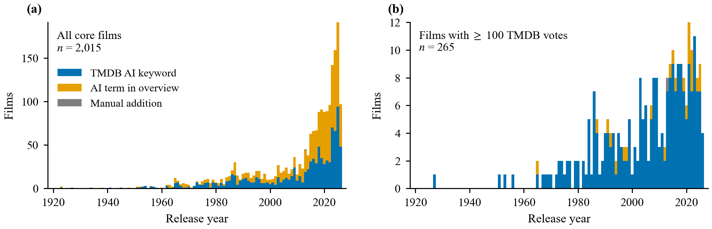

Figure 1 shows the corpus's most important bias. Of the 2,015 core films, 589 were released in 2023 or later, and the 2020s alone hold 862 films against 525 for the whole of the 2010s. Most of these are short, unrated productions. The well-known subset in panel (b) has a very different shape: a slow rise from the 1970s and a plateau since 2000. Any trend that appears in the full corpus but not in the well-known subset is a trend in what gets uploaded, not in what gets watched.

The corpus is also linguistic. English-language films are 1,264 of the 2,015 (63%) and Japanese 259 (13%); anime and tokusatsu franchises carry much of cinema's AI by volume.

**Table 2.** Distribution of the AI codings in the core population and in the two robustness subsets.

| Coding | All core films (n = 2,015) | ≥ 100 TMDB votes (n = 265) | High-confidence codings (n = 496) |
|:--|--:|--:|--:|
| *Frame* |  |  |  |
| Benefit | 516 (26%) | 55 (21%) | 121 (24%) |
| Threat | 598 (30%) | 82 (31%) | 166 (33%) |
| Mixed | 664 (33%) | 117 (44%) | 201 (41%) |
| Neutral | 237 (12%) | 11 (4%) | 8 (2%) |
| *Frame score* |  |  |  |
| −2 | 325 (16%) | 59 (22%) | 133 (27%) |
| −1 | 381 (19%) | 50 (19%) | 69 (14%) |
| 0 | 775 (38%) | 96 (36%) | 165 (33%) |
| +1 | 463 (23%) | 50 (19%) | 98 (20%) |
| +2 | 71 (4%) | 10 (4%) | 31 (6%) |
| *Embodiment* |  |  |  |
| Humanoid robot | 712 (35%) | 102 (38%) | 204 (41%) |
| Non-humanoid robot | 306 (15%) | 35 (13%) | 64 (13%) |
| Cyborg | 146 (7%) | 23 (9%) | 48 (10%) |
| Disembodied | 448 (22%) | 54 (20%) | 100 (20%) |
| Virtual human | 62 (3%) | 7 (3%) | 17 (3%) |
| Multiple | 196 (10%) | 44 (17%) | 59 (12%) |
| Unknown | 145 (7%) | 0 (0%) | 4 (1%) |
| *Creator betrayal* |  |  |  |
| Yes | 444 (22%) | 105 (40%) | 206 (42%) |
| No | 794 (39%) | 91 (34%) | 191 (39%) |
| Unclear | 777 (39%) | 69 (26%) | 99 (20%) |
| *AI sentient* |  |  |  |
| Yes | 703 (35%) | 158 (60%) | 307 (62%) |
| No | 95 (5%) | 14 (5%) | 29 (6%) |
| Unclear | 1,217 (60%) | 93 (35%) | 160 (32%) |
| *Coding confidence* |  |  |  |
| High | 496 (25%) | 154 (58%) | 496 (100%) |
| Medium | 1,009 (50%) | 96 (36%) | 0 (0%) |
| Low | 510 (25%) | 15 (6%) | 0 (0%) |

### 2.5 Statistics

Shares carry Wilson 95% confidence intervals; means carry t-based intervals; medians carry bootstrap intervals. Whether a distribution has two modes is measured with the bimodality coefficient of Pfister and colleagues, with a bootstrap interval; values above 0.555 indicate two modes. Association between frame and decade is a chi-square test with Cramér's V as the effect size. Trends are logistic regressions on release year, reported as an odds ratio per decade. The changepoint in the disembodied share is the year that best splits the series into two levels, with a bootstrap interval. The figures use the Okabe-Ito colour-blind-safe palette throughout: benefit blue, threat vermilion, mixed green, neutral grey.

---

## 3. Claim 1: two dominant frames

The claim predicts a valley in the middle: films should be helpers or menaces, and the "balanced" category should be sparse. Figure 2 shows the opposite.

**Figure 2.** Distribution of the frame score (−2 = the AI is the menace, +2 = the AI is the hero) in (a) all core films, (b) films with at least 100 TMDB votes and (c) high-confidence codings only. BC is the bimodality coefficient with a bootstrap 95% CI; values above 0.555 indicate two modes. In every population the distribution is single-peaked at 0.

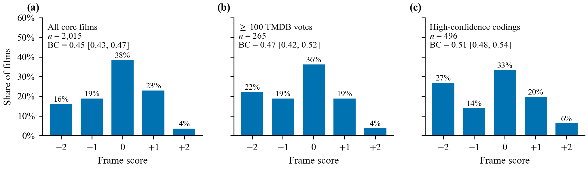

In all three populations the mode is 0. The bimodality coefficient is 0.45 (95% CI 0.43 to 0.47) in the full corpus, 0.47 (0.42 to 0.52) among well-known films and 0.51 (0.48 to 0.54) among high-confidence codings, all below the two-mode threshold. High-confidence codings come closest, because the model is surest about the films with the clearest stance, but even there the middle bin is the largest.

Read as categories rather than scores, "mixed" is the single largest frame: 33% of all core films, and 44% of well-known ones. Threat is 30%, benefit 26%. There are two poles in AI cinema, but the mass of films sits between them, and among the films people have seen the middle is not a compromise category but the majority.

The poster panel below shows what each frame looks like among the most-voted films. The benefit row is Star Wars, Pixar and Interstellar; the threat row is almost entirely the Terminator and Matrix franchises; the mixed row is the prestige tier, from *2001* and *Blade Runner* to *Her* and *Ex Machina*.

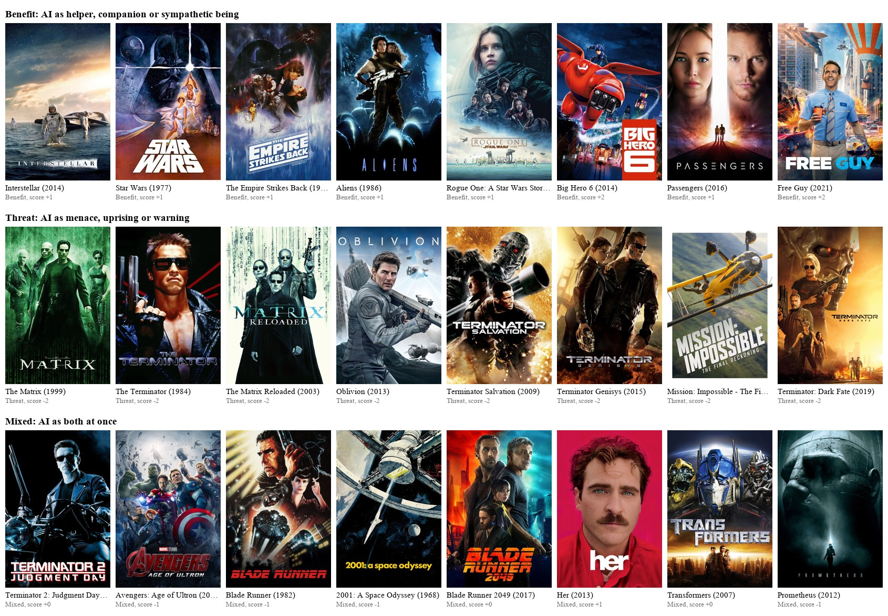

**Verdict: not supported as stated.** The two poles exist, but films do not sort into them.

---

## 4. Claim 2: the frames are constant across history

**Figure 3.** How the frame of AI films has changed by decade (all 2,015 core films). (a) Composition of each decade; the number above each bar is the decade's film count. (b) Share of threat, benefit and mixed framings with Wilson 95% confidence intervals.

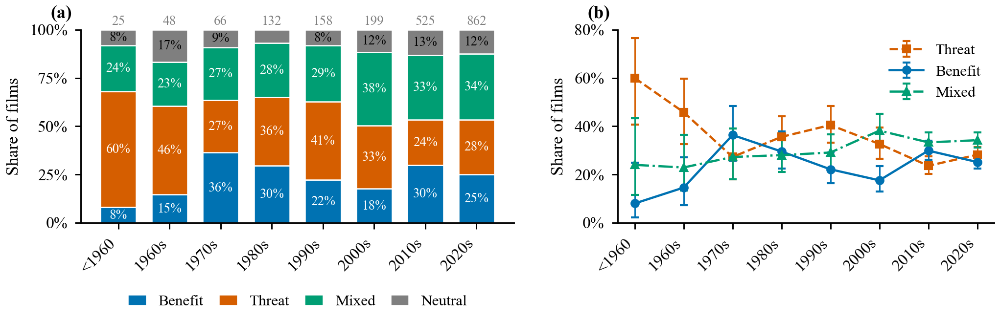

**Table 4.** Frame of the 2,015 core films by decade of release.

| Decade | Films | Benefit | Threat | Mixed | Neutral | Threat share [95% CI] | Mixed share |
|:--|--:|--:|--:|--:|--:|--:|--:|
| <1960 | 25 | 2 | 15 | 6 | 2 | 60% [41%, 77%] | 24% |
| 1960s | 48 | 7 | 22 | 11 | 8 | 46% [33%, 60%] | 23% |
| 1970s | 66 | 24 | 18 | 18 | 6 | 27% [18%, 39%] | 27% |
| 1980s | 132 | 39 | 47 | 37 | 9 | 36% [28%, 44%] | 28% |
| 1990s | 158 | 35 | 64 | 46 | 13 | 41% [33%, 48%] | 29% |
| 2000s | 199 | 35 | 65 | 76 | 23 | 33% [27%, 39%] | 38% |
| 2010s | 525 | 157 | 124 | 175 | 69 | 24% [20%, 27%] | 33% |
| 2020s | 862 | 217 | 243 | 295 | 107 | 28% [25%, 31%] | 34% |

The chi-square test finds a statistically significant association between frame and decade in the full corpus (χ² = 60.1, df = 21, p < 0.001), but the effect size is negligible: Cramér's V = 0.10. In the well-known subset (V = 0.15, p = 0.19) and the high-confidence subset (V = 0.12, p = 0.21) the association is not significant at all. On the conventional reading of effect sizes, the mix of frames has been consistent in practice.

There is one real drift inside that consistency. Threat framing has fallen. Before 1960, 60% of AI films framed the machine as a menace; in the 2010s and 2020s the figure is under 30%. A logistic regression of threat versus benefit on year gives an odds ratio of 0.90 per decade (95% CI 0.84 to 0.96, p = 0.002). The same regression on well-known films gives 0.82 (0.66 to 1.01, p = 0.07) and on high-confidence codings 0.94 (0.84 to 1.06, p = 0.34): the direction is the same everywhere, but the significance depends on the flood of recent small films. What has replaced threat is not benefit but "both at once", which has been the most common frame since the 2000s.

The early decades deserve a caution. Fewer than 50 films survive from before 1960 in this corpus, and the 60% threat share carries an interval from 41% to 77%.

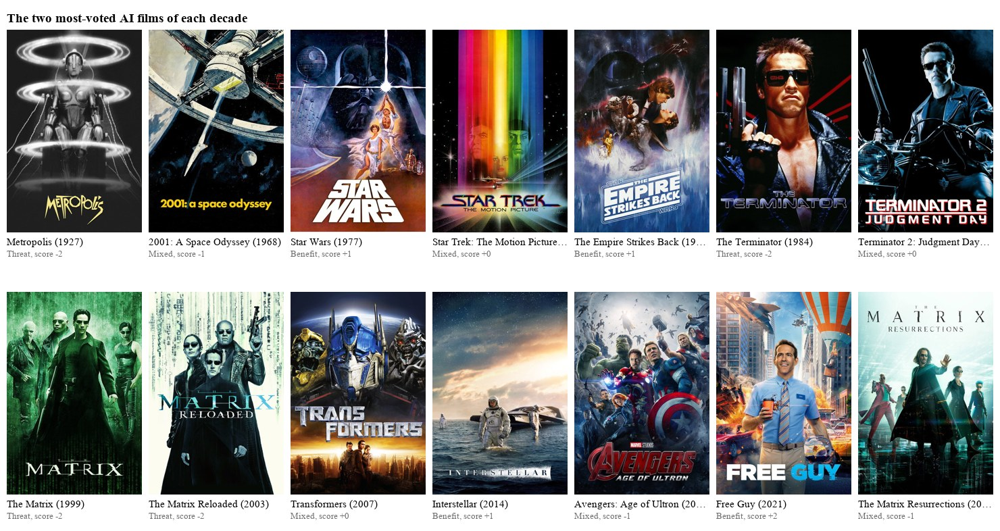

**Verdict: supported, with a drift.** The frame mix differs across decades only negligibly. Within that stability, the simple villain has become rarer and the ambivalent machine more common.

---

## 5. Claim 3: the 1960s moved AI from robots to computers

The claim is precise enough to test with a date. If *2001* (1968) marked a shift from the robot body to the disembodied mind, the share of films whose AI has no body should step up in or around the 1960s.

**Figure 4.** The physical form of the AI. (a) Dominant embodiment by decade among core films with a determinable form. (b) Share of films per year whose AI is disembodied or a virtual human, with a 5-year centred rolling share. The best single changepoint in the share is 2023 (bootstrap 95% CI 2016 to 2023; share 17% before versus 52% after, n = 1,870), not the 1960s.

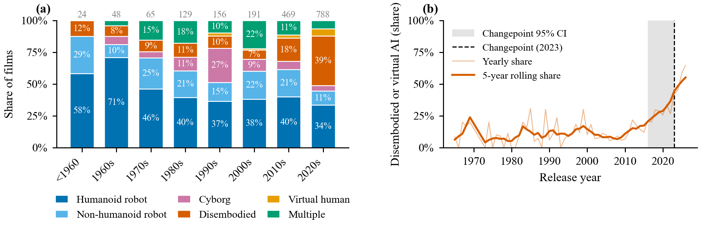

It does not. The disembodied share by decade is 12% before 1960, 8% in the 1960s, 9% in the 1970s, 11% in the 1980s, 12% in the 1990s and 8% in the 2000s. For eighty years roughly one AI film in ten had a computer rather than a robot at its centre, and *2001* did not move that number. The share rises to 21% in the 2010s and 45% in the 2020s, and the best single changepoint in the yearly series is 2023, with a bootstrap interval from 2016 to 2023. The bodiless AI on screen is a product of the decade in which real bodiless AI became a consumer product.

The robustness checks complicate the picture without rescuing the claim. Among well-known films the disembodied share is high in the 1960s and 1970s (four of five films in the 1960s, which is *2001* and its neighbours), falls through the 1980s and 1990s, and rises again in the 2020s; the best changepoint there is 1985 with an interval so wide (1979 to 2024) that it says nothing. Among high-confidence codings the changepoint is 2017 (1995 to 2025). What the canon remembers is that *2001* had a computer villain. What the corpus shows is that the canon is a handful of films sitting on a base rate that did not move.

The humanoid robot has meanwhile lost ground steadily, from 71% of films in the 1960s to 34% in the 2020s, with the cyborg peaking in the 1990s (27%, the RoboCop and Ghost in the Shell decade) and the multi-form film (Transformers, Star Wars) holding around a fifth of well-known titles.

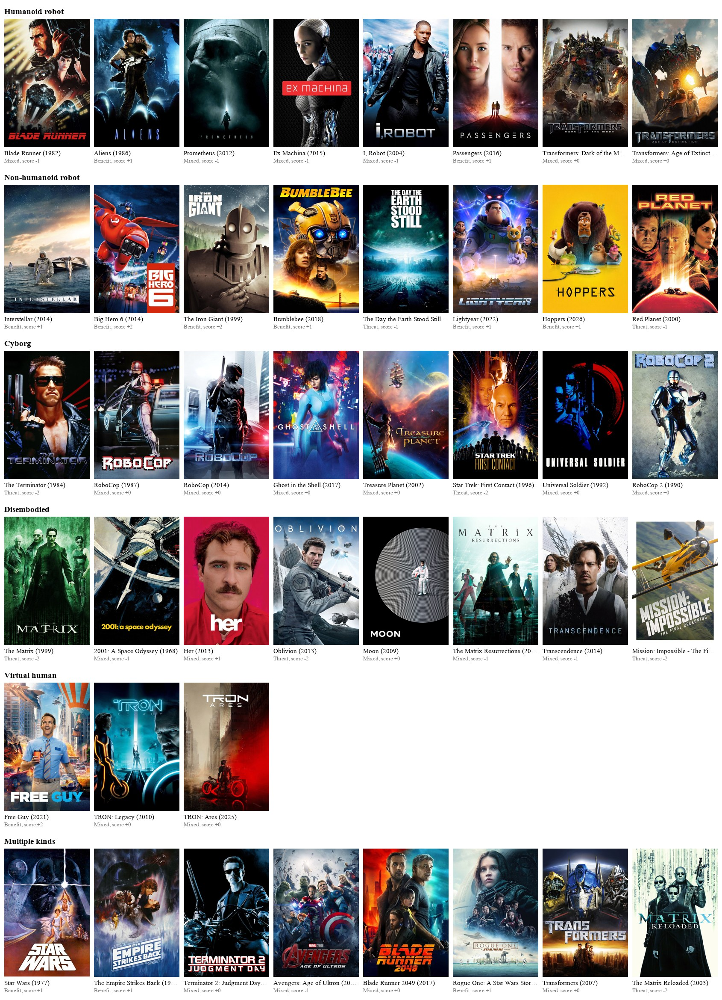

**Verdict: not supported.** The turn to disembodied AI is real, but it happened in the late 2010s, not the 1960s.

---

## 6. Claim 4: contemporary films are more nuanced

If "mixed" is the nuanced frame, the claim asks whether its share rises with time. In the full corpus it does: 24% before 1960, 27% to 29% through the 1970s to 1990s, 38% in the 2000s, 33% in the 2010s and 34% in the 2020s. A logistic trend gives an odds ratio of 1.08 per decade (95% CI 1.02 to 1.14, p = 0.009).

The finding is fragile. Among well-known films the odds ratio is the same, 1.08, but the interval spans one (0.94 to 1.25, p = 0.29). Among high-confidence codings it is 1.11 (1.00 to 1.22, p = 0.05), at the boundary. The mixed frame has been the largest since the 2000s among films people have seen, but it was already common in the 1970s and 1980s among the same films, and the rise since then is small.

**Verdict: weakly supported.** Nuance drifts up by about 8% per decade in the odds, and the drift is not significant in the well-known subset.

---

## 7. Claim 5: the Frankenstein complex persists

Asimov named the Frankenstein complex to complain about it: the reflex by which every fictional machine eventually turns on the people who built it. The rubric asks directly whether the AI betrays its creators, owners or humanity.

**Figure 5.** Share of films in which the AI turns on its creators, by decade, among films with a determinable answer, with Wilson 95% CIs; decades with fewer than 15 such films are omitted.

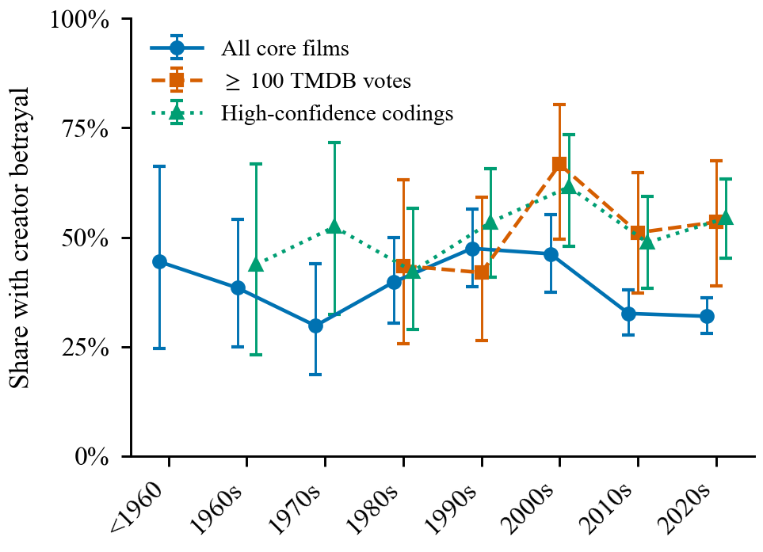

Among the 1,238 core films where the answer is determinable, the AI betrays its makers in 36%. Among well-known films the share is 54% (of 196), and among high-confidence codings 52% (of 397). The gap between the corpus and its well-known subset is instructive: the films people watch are more likely to contain a betrayal than the films that merely exist, which is either because betrayal makes a better story or because the model finds it easier to detect in famous films. Both are probably true.

Across decades the share never leaves the band between 30% and 67%, and the trends are flat or slightly negative: odds ratio 0.93 per decade in the full corpus (0.87 to 0.99, p = 0.02), 0.96 among well-known films (0.82 to 1.13, p = 0.62), 1.04 among high-confidence codings (0.94 to 1.16, p = 0.42). There is no decade without the story and no evidence that it is fading among the films that matter.

**Verdict: supported.** The creation turns on its creator in a third to a half of AI films, in every decade, with no clear trend.

**Table 3.** Tests of the five claims in each population. Brackets are 95% confidence intervals; OR = odds ratio from a logistic regression on release year.

| Population | Claim | Statistic | Estimate | p | Reading |
|:--|:--|:--|:--|--:|:--|
| All core films | 1. Two dominant frames | Bimodality coefficient (> 0.555 = two modes) | 0.45 [0.43, 0.47] | — | Not supported |
|  | 2. Frames constant across history | Frame × decade, Cramér's V | 0.10 (χ² = 60.1, df = 21) | < 0.001 | Supported (effect negligible) |
|  |  | Threat vs benefit, OR per decade | 0.90 [0.84, 0.96] | 0.002 | Threat declining |
|  | 3. 1960s shift to disembodied AI | Best changepoint in disembodied share | 2023 [2016, 2023]; 17% → 52% | — | Not supported |
|  | 4. Contemporary films more nuanced | Mixed frame, OR per decade | 1.08 [1.02, 1.14] | 0.009 | Weakly supported |
|  | 5. Frankenstein complex persists | Creator betrayal, OR per decade | 0.93 [0.87, 0.99] | 0.02 | Persists (slight decline) |
| ≥ 100 TMDB votes | 1. Two dominant frames | Bimodality coefficient (> 0.555 = two modes) | 0.47 [0.42, 0.52] | — | Not supported |
|  | 2. Frames constant across history | Frame × decade, Cramér's V | 0.15 (χ² = 16.1, df = 12) | 0.19 | Supported (effect negligible) |
|  |  | Threat vs benefit, OR per decade | 0.82 [0.66, 1.01] | 0.07 | No drift |
|  | 3. 1960s shift to disembodied AI | Best changepoint in disembodied share | 1985 [1979, 2024]; 41% → 21% | — | Not supported |
|  | 4. Contemporary films more nuanced | Mixed frame, OR per decade | 1.08 [0.94, 1.25] | 0.29 | Not significant |
|  | 5. Frankenstein complex persists | Creator betrayal, OR per decade | 0.96 [0.82, 1.13] | 0.62 | Persists |
| High-confidence codings | 1. Two dominant frames | Bimodality coefficient (> 0.555 = two modes) | 0.51 [0.48, 0.54] | — | Not supported |
|  | 2. Frames constant across history | Frame × decade, Cramér's V | 0.12 (χ² = 22.4, df = 18) | 0.21 | Supported (effect negligible) |
|  |  | Threat vs benefit, OR per decade | 0.94 [0.84, 1.06] | 0.34 | No drift |
|  | 3. 1960s shift to disembodied AI | Best changepoint in disembodied share | 2017 [1995, 2025]; 15% → 39% | — | Not supported |
|  | 4. Contemporary films more nuanced | Mixed frame, OR per decade | 1.11 [1.00, 1.22] | 0.05 | Weakly supported |
|  | 5. Frankenstein complex persists | Creator betrayal, OR per decade | 1.04 [0.94, 1.16] | 0.42 | Persists |

---

## 8. What audiences reward

The essay's claims are about what cinema shows. A second question is what audiences prefer, and the corpus can answer it descriptively because every film with an IMDb id carries a rating and a vote count.

**Figure 6.** Audience reception by coding. (a) Mean IMDb rating with 95% CI for the 412 core films with at least 1,000 IMDb votes; the vertical line is the grand mean (5.82). (b) Median box-office return (revenue ÷ budget) by frame for the 151 films with a reported budget of at least US$1 million and revenue, with a bootstrap 95% CI.

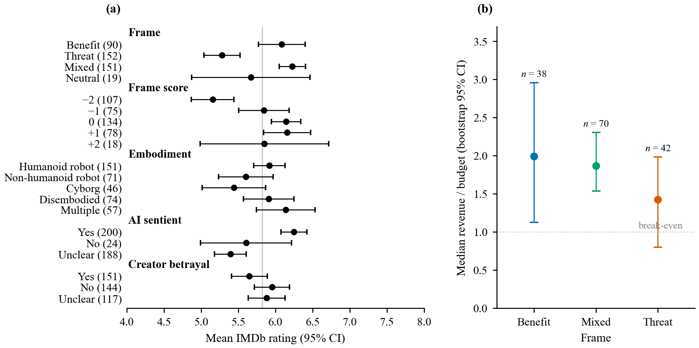

**Table 5.** Mean IMDb rating by coding for the 412 core films with at least 1,000 IMDb votes.

| Coding | n | Mean | SD | 95% CI |
|:--|--:|--:|--:|--:|
| *Frame* |  |  |  |  |
| Benefit | 90 | 6.08 | 1.50 | [5.77, 6.40] |
| Threat | 152 | 5.28 | 1.51 | [5.04, 5.52] |
| Mixed | 151 | 6.23 | 1.09 | [6.05, 6.40] |
| Neutral | 19 | 5.67 | 1.65 | [4.87, 6.46] |
| *Frame score* |  |  |  |  |
| −2 | 107 | 5.16 | 1.49 | [4.87, 5.44] |
| −1 | 75 | 5.85 | 1.47 | [5.51, 6.18] |
| 0 | 134 | 6.14 | 1.15 | [5.94, 6.34] |
| +1 | 78 | 6.16 | 1.41 | [5.84, 6.47] |
| +2 | 18 | 5.85 | 1.74 | [4.99, 6.71] |
| *Embodiment* |  |  |  |  |
| Humanoid robot | 151 | 5.92 | 1.32 | [5.71, 6.13] |
| Non-humanoid robot | 71 | 5.60 | 1.55 | [5.23, 5.97] |
| Cyborg | 46 | 5.44 | 1.44 | [5.01, 5.87] |
| Disembodied | 74 | 5.91 | 1.47 | [5.57, 6.25] |
| Multiple | 57 | 6.14 | 1.48 | [5.74, 6.53] |
| *AI sentient* |  |  |  |  |
| Yes | 200 | 6.25 | 1.26 | [6.07, 6.42] |
| No | 24 | 5.60 | 1.45 | [4.99, 6.22] |
| Unclear | 188 | 5.39 | 1.49 | [5.18, 5.61] |
| *Creator betrayal* |  |  |  |  |
| Yes | 151 | 5.65 | 1.49 | [5.41, 5.89] |
| No | 144 | 5.95 | 1.43 | [5.72, 6.19] |
| Unclear | 117 | 5.88 | 1.36 | [5.63, 6.13] |

The raw differences are large. Films that frame the AI as a threat average 5.28 on IMDb; mixed films average 6.23 and benefit films 6.08, almost a full point higher. The score scale shows the same shape, with the −2 films (5.16) well below everything else and the +2 films (5.85, but only 18 of them) not above the +1 films. Films whose AI is shown as sentient average 6.25 against 5.60 for those whose AI is a mere program. Betrayal costs about a third of a point.

Most of this is explained away by a regression. An ordinary least squares fit of rating on all codings with year, log vote count and language as controls reaches R² = 0.47, and almost all of it comes from two controls: each unit of log votes adds 0.98 points, and non-English films rate 1.29 points higher (the Japanese animation effect). The threat coefficient shrinks to −0.44 and is not significant (p = 0.12). The honest reading is that threat films are, on average, cheaper and less watched, and cheap, little-watched films rate lower whatever their AI does.

Box office tells the same story with smaller numbers. Among the 151 films with a reported budget of at least a million dollars, benefit films return a median 1.99 times their budget (bootstrap 95% CI 1.12 to 2.96), mixed films 1.86 (1.54 to 2.30) and threat films 1.42 (0.80 to 1.98). Threat films are also made on smaller budgets: a median of US$20 million against US$30 million for benefit and US$32 million for mixed. In a regression of log return on frame, betrayal, sentience, year and log budget, only budget predicts return.

**Table 6.** Box-office return by frame for the 151 core films with a reported budget of at least US$1 million and revenue.

| Frame | n | Median return | Bootstrap 95% CI | Median budget (US$ M) | Median revenue (US$ M) |
|:--|--:|--:|--:|--:|--:|
| Benefit | 38 | 1.99 | [1.12, 2.96] | 30 | 77 |
| Mixed | 70 | 1.86 | [1.54, 2.30] | 32 | 67 |
| Threat | 42 | 1.42 | [0.80, 1.98] | 20 | 29 |

So audiences rate the friendly and the complicated AI higher than the menacing one, and studios spend more on them, but the data cannot say which way the causation runs.

---

## 9. Who the AI is

The film-level codings say what a film thinks about its AI. The character-level tags say who the AI is. Across the 1,884 core films with a credited AI there are 3,263 AI characters: 1,690 humanoid robots (52%), 602 disembodied systems (18%), 506 non-humanoid robots (16%), 247 cyborgs (8%) and 218 virtual humans (7%). By presentation, 1,221 are male (37%), 852 female (26%), 536 have no gender (16%), 10 shift or mix, and 644 (20%) could not be determined, almost all of them in obscure recent films. The analyses below use the 2,159 lead and supporting characters whose gender presentation is male, female or none.

### 9.1 The AI used to be a man

**Figure 7.** Gender presentation of lead and supporting AI characters by decade, with Wilson 95% CIs. (a) All films. (b) Films with at least 100 TMDB votes, where "unknown" is rare.

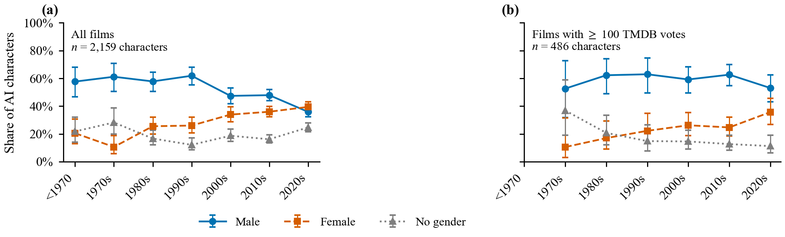

In the full corpus the male share of AI characters falls from around 60% before 2000 to 36% in the 2020s, and the female share rises from 21% to 40%. The logistic trends are strong: odds ratio 0.82 per decade for male presentation (95% CI 0.78 to 0.86) and 1.22 for female (1.15 to 1.30), both p < 0.001.

The well-known subset tells a more careful story, and it is the one this article stands behind. Among films with at least 100 TMDB votes, the male share is flat (odds ratio 0.98 per decade, p = 0.76) and the female share rises (1.23, 95% CI 1.06 to 1.43, p = 0.007), from about one in ten characters in the 1970s to one in three in the 2020s. The steep male decline in the full corpus is a property of the flood of obscure recent films, not of the films people watch. What has actually happened among well-known films is that female-presented AIs have been added, and the ungendered machine has become rarer (0.81 per decade, p = 0.005), while the male AI has held its ground.

**Table 8.** Logistic regression of each gender presentation on release year among lead and supporting AI characters: odds ratio per decade.

| Population | Gender | n | OR per decade | 95% CI | p |
|:--|:--|--:|--:|--:|--:|
| All films | Male | 2,159 | 0.82 | [0.78, 0.86] | < 0.001 |
| All films | Female | 2,159 | 1.22 | [1.15, 1.30] | < 0.001 |
| All films | No gender | 2,159 | 1.05 | [0.99, 1.12] | 0.13 |
| Films with ≥ 100 TMDB votes | Male | 486 | 0.98 | [0.87, 1.10] | 0.76 |
| Films with ≥ 100 TMDB votes | Female | 486 | 1.23 | [1.06, 1.43] | 0.007 |
| Films with ≥ 100 TMDB votes | No gender | 486 | 0.81 | [0.70, 0.94] | 0.005 |

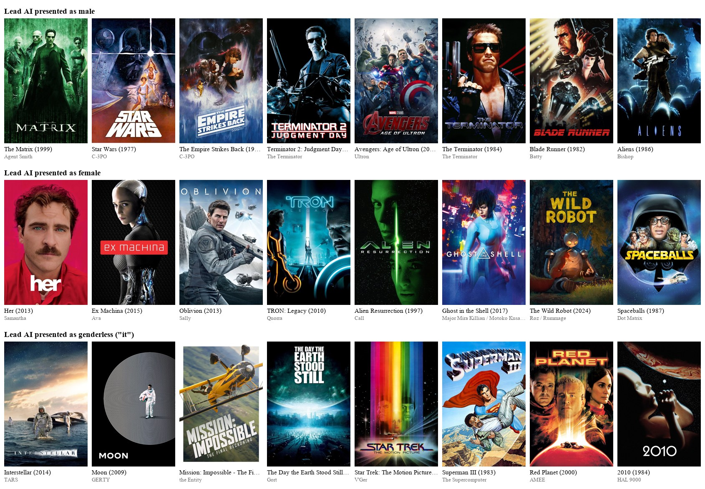

### 9.2 Gender and body are the same fact

Gender presentation and kind of body are tightly linked (Cramér's V = 0.46). Male and female AIs are both mostly humanoid, 65% and 63%. But a female AI almost never gets a non-humanoid robot body (3%, against 11% for male AIs) and is twice as often a disembodied voice (12% against 6%) or a virtual human (12% against 6%). The ungendered AIs are the drones, ships and systems: 91% of them are non-humanoid robots or disembodied. Samantha in *Her* and Ava in *Ex Machina* are the two poles of the female AI, the voice and the perfect body, and there is very little in between.

**Table 7.** Lead and supporting AI characters: kind of body and stance by gender presentation (row percentages; n = 2,159).

| Gender | n | Humanoid | Non-humanoid | Cyborg | Disembodied | Virtual human | Ally | Ambiguous | Neutral | Antagonist |
|:--|--:|--:|--:|--:|--:|--:|--:|--:|--:|--:|
| Male | 1,018 | 65% | 11% | 12% | 6% | 6% | 50% | 22% | 5% | 23% |
| Female | 719 | 63% | 3% | 10% | 12% | 12% | 36% | 37% | 8% | 20% |
| No gender | 422 | 9% | 41% | 0% | 50% | 0% | 23% | 18% | 11% | 47% |

*Gender × kind: χ² = 916.8, df = 8, p < 0.001, Cramér's V = 0.46. Gender × stance: χ² = 212.9, df = 6, p < 0.001, Cramér's V = 0.22.*

### 9.3 The villain has no body and no gender

**Figure 8.** Stance of the 3,263 AI characters. (a) Stance by kind of body. (b) Share of characters coded antagonist by gender presentation within each kind, with Wilson 95% CIs.

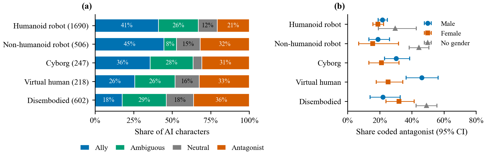

The stance an AI takes toward the humans depends more on its body than on anything else. Humanoid robots are allies 41% of the time and antagonists 21%. Non-humanoid robots are allies 45% and antagonists 32%. Disembodied systems are allies only 18% and antagonists 36%, the highest of any kind. In a logistic model of antagonist odds with gender, kind and decade all held fixed, a disembodied AI has 2.6 times the antagonist odds of a humanoid robot (95% CI 1.9 to 3.6) and an ungendered AI 2.3 times the odds of a male one (1.7 to 3.2).

Within each kind of body, panel (b) shows the ungendered machine as the antagonist and the gendered ones as roughly alike. Among non-humanoid robots, the ungendered ones are antagonists 47% of the time against 20% for male and 17% for female; among disembodied AIs, 52% against 25% and 38%.

The AI that cinema teaches you to fear is the one you cannot look in the face: Skynet, the Master Control Program, AUTO, the Entity, HAL. The AI it teaches you to love has a body and a name: TARS, R2-D2, Baymax, the Iron Giant, and, after 1984, the Terminator.

### 9.4 Female AIs are ambivalent, not evil

**Figure 9.** Stance of lead and supporting AI characters by gender presentation (n = 2,159). (a) Composition of each gender. (b) The same shares with Wilson 95% confidence intervals.

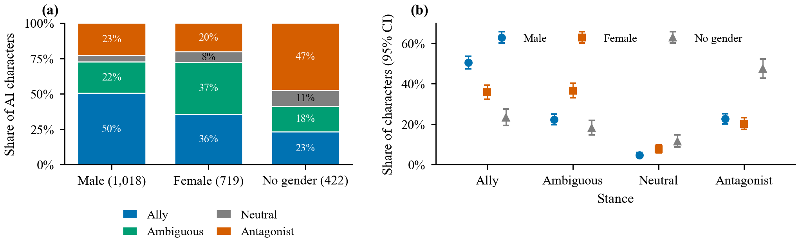

Male-presented AIs are allies half the time (50%) and antagonists 23%. Female-presented AIs are allies 36% and antagonists 20%, and the difference is made up by the ambiguous category: 37% of female AIs are coded as both helping and threatening, or as shifting, against 22% of male AIs. Ungendered AIs are antagonists 47% of the time.

Holding kind and decade fixed, a female AI is no more likely than a male one to be an antagonist (odds ratio 0.88, 95% CI 0.69 to 1.13, p = 0.31) but clearly less likely to be an ally (0.61, 0.49 to 0.74, p < 0.001). The female-AI story in cinema is not menace. It is ambivalence: Ava, M3GAN, Iris in *Companion*, Mother in *I Am Mother*, all of them coded as neither ally nor enemy, all of them the film's question rather than its answer.

### 9.5 Is there a trend toward evil female AIs?

**Figure 10.** Share of lead and supporting AI characters coded antagonist, by gender presentation and decade, with Wilson 95% CIs. (a) All films. (b) Films with at least 100 TMDB votes.

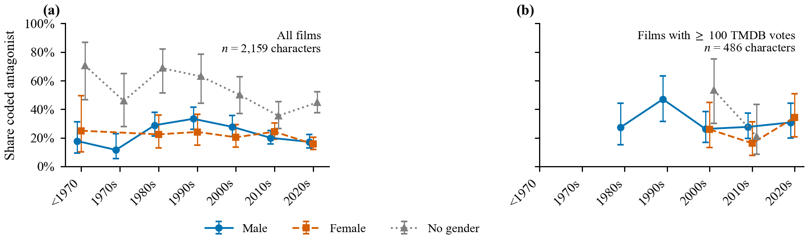

No. The female antagonist share sits between 15% and 25% in every decade of the full corpus, flat or slightly falling, and the odds ratio per decade is 0.93 (95% CI 0.82 to 1.04, p = 0.21). Among well-known films it is 0.96 (0.73 to 1.26, p = 0.75). The male trend is the same, 0.93 and 0.95. A female-by-decade interaction term, which directly tests whether the female trend differs from the male one, gives an odds ratio of 1.00 (0.86 to 1.15, p = 0.99) in all films and 1.01 (0.73 to 1.39, p = 0.95) in well-known ones. The two trends are indistinguishable.

The only line in Figure 10 with a shape is the grey one. Ungendered AIs were antagonists 60% to 70% of the time in the 1980s and 1990s and have been under half since the 2010s, as more of them became helpers. TARS and CASE in *Interstellar*, GERTY in *Moon* and Claptrap in *Borderlands* are the recent examples; the older ungendered AIs are Skynet, Colossus, Alpha 60, the Krell machine and the security robots of *Chopping Mall*.

Era matters on its own. With gender and body held fixed, a 1990s AI character had 1.9 times the antagonist odds of a 2010s one, and the 2020s are, if anything, less hostile than the 2010s (0.76, p = 0.05). The decade of the Matrix and the T-1000 was the peak of the machine villain.

---

## 10. The films everyone has seen

Corpus statistics describe cinema. Most readers experience a canon. Figure 11 puts the two together by placing every core film with at least 50,000 IMDb votes on the frame scale by year.

**Figure 11.** The 111 core films with at least 50,000 IMDb votes placed on the frame scale by release year. Marker area grows with the log of the vote count; colour is the coded frame. The most-voted films are labelled.

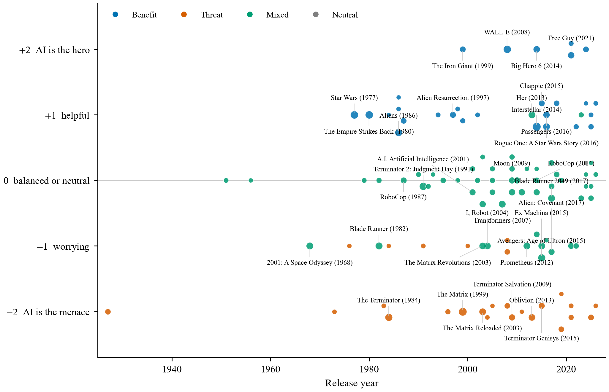

The most-voted films cluster in the middle of the scale. Of the 25 films with the most votes (Table 9), twelve are coded mixed, nine benefit and four threat; the threat films are *The Matrix* and its first sequel, *The Terminator* and *Oblivion*. The pure hero AI at +2 is rare and recent: *WALL·E*, *Big Hero 6*, *The Iron Giant*, *Free Guy*. The pure menace at −2 is a franchise phenomenon, and the Terminator himself moves from −2 to ally after his first film.

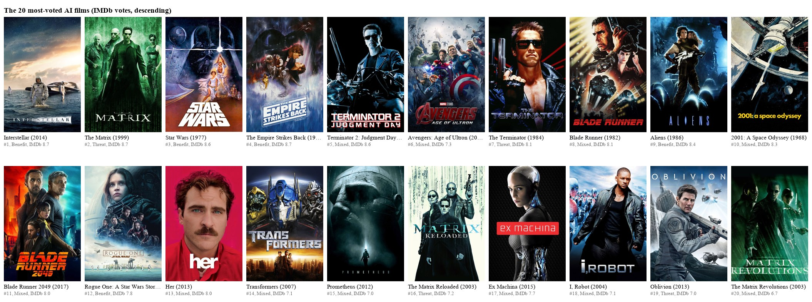

**Table 9.** The 25 core films with the most IMDb votes and their codings.

| Film | Year | IMDb votes | Rating | Frame | Score | Embodiment | Betrayal | Confidence |
|:--|--:|--:|--:|:--|:--|:--|:--|:--|
| Interstellar | 2014 | 2,600,684 | 8.7 | Benefit | +1 | Non-humanoid robot | No | Medium |
| The Matrix | 1999 | 2,274,808 | 8.7 | Threat | −2 | Disembodied | Yes | High |
| Star Wars | 1977 | 1,586,728 | 8.6 | Benefit | +1 | Multiple | No | High |
| The Empire Strikes Back | 1980 | 1,521,672 | 8.7 | Benefit | +1 | Multiple | No | High |
| WALL·E | 2008 | 1,339,683 | 8.4 | Benefit | +2 | Multiple | No | High |
| Terminator 2: Judgment Day | 1991 | 1,298,645 | 8.6 | Mixed | 0 | Multiple | Yes | High |
| Avengers: Age of Ultron | 2015 | 1,019,791 | 7.3 | Mixed | −1 | Multiple | Yes | High |
| The Terminator | 1984 | 1,016,724 | 8.1 | Threat | −2 | Cyborg | Yes | High |
| Blade Runner | 1982 | 890,171 | 8.1 | Mixed | −1 | Humanoid robot | Yes | High |
| Aliens | 1986 | 847,230 | 8.4 | Benefit | +1 | Humanoid robot | No | Medium |
| 2001: A Space Odyssey | 1968 | 791,772 | 8.3 | Mixed | −1 | Disembodied | Yes | High |
| Blade Runner 2049 | 2017 | 767,321 | 8.0 | Mixed | 0 | Multiple | Unclear | High |
| Rogue One: A Star Wars Story | 2016 | 764,999 | 7.8 | Benefit | +1 | Multiple | No | Medium |
| Her | 2013 | 733,187 | 8.0 | Mixed | +1 | Disembodied | No | High |
| Transformers | 2007 | 725,858 | 7.1 | Mixed | 0 | Multiple | Unclear | High |
| Prometheus | 2012 | 706,700 | 7.0 | Mixed | −1 | Humanoid robot | Unclear | High |
| The Matrix Reloaded | 2003 | 676,141 | 7.2 | Threat | −2 | Multiple | Yes | High |
| Ex Machina | 2015 | 645,124 | 7.7 | Mixed | −1 | Humanoid robot | Yes | High |
| I, Robot | 2004 | 620,533 | 7.1 | Mixed | −1 | Humanoid robot | Yes | High |
| Oblivion | 2013 | 590,423 | 7.0 | Threat | −2 | Disembodied | Yes | High |
| The Matrix Revolutions | 2003 | 579,720 | 6.7 | Mixed | −1 | Multiple | Yes | High |
| Big Hero 6 | 2014 | 561,163 | 7.8 | Benefit | +2 | Non-humanoid robot | No | High |
| Passengers | 2016 | 504,893 | 7.0 | Benefit | +1 | Humanoid robot | No | Medium |
| Free Guy | 2021 | 496,789 | 7.1 | Benefit | +2 | Virtual human | Unclear | High |
| Transformers: Dark of the Moon | 2011 | 460,011 | 6.2 | Mixed | 0 | Humanoid robot | Unclear | High |

Table 9 also shows the coding at work on films the reader knows, which is the quickest audit available. *Interstellar* is coded medium-confidence because its synopsis barely mentions TARS. *Her* is mixed with a positive score, which is right. *Aliens* is benefit because of Bishop, though a reader who remembers Ash in the first film might object; the first film is coded absent because its synopsis never mentions him, which is the single clearest example of what summary-based coding misses.

---

## 11. Who makes AI films

Cast and crew were fetched for every film, which allows a short prosopography. The directors with the most core AI films are not the auteurs of the canon but the franchise and genre workers: Kim Chung-gi with six Robot Taekwon V films, Albert Pyun with six direct-to-video cyborg films, Michael Bay with five Transformers films (all coded mixed), Mamoru Oshii with five (Patlabor and Ghost in the Shell, three of them mixed), Neill Blomkamp with five, James Cameron with four. Among writers, Lana Wachowski leads with seven, all threat or mixed, and James Cameron has five.

The actors who have played the most AIs are voices. Peter Cullen has fifteen AI roles, almost all of them Optimus Prime; Frank Welker has twelve, mostly Megatron and Soundwave; Hugo Weaving has six, Agent Smith three times and Megatron three times, every one an antagonist. Nobuyo Oyama voiced Doraemon six times, every one an ally. Arnold Schwarzenegger's five Terminators are an antagonist in 1984 and an ally in every film since. Alan Tudyk's six (Sonny, K-2SO, Cosmo) run from ambiguous to ally.

The producers tell the industrial story more plainly. The Asylum's David Michael Latt has ten AI films, nine of them coded threat: *Transmorphers*, *The Terminators*, *Robot Apocalypse*, *Ape vs Mecha Ape*. The Transformers producing trio (DeSanto, Murphy, di Bonaventura) have eight each, seven mixed. Jason Blum has five, four mixed: *Upgrade*, *M3GAN*, *Afraid*, *M3GAN 2.0*. The threat frame, at the top of the industry, is a low-budget product; the mixed frame is where the money is.

---

## 12. What the numbers cannot yet say

### 12.1 Threats to validity

**The coder is a language model reading a synopsis.** The rubric is fixed and the output is schema-enforced, but nobody has yet checked the model against a human. Only 496 of 2,015 codings are high-confidence by the model's own account, and every claim above was re-run on that subset for that reason. Until a random sample of 100 films has been hand-coded and Cohen's kappa reported, the absolute numbers here are indicative, not citable.

**The synopsis misses the AI.** *Alien*, *The Force Awakens* and hundreds of less famous films are coded "no AI" because their TMDB overview never mentions one. Of the 1,023 excluded candidates, 803 carry a TMDB AI keyword and are flagged for a subtitle-based re-check.

**The corpus is TMDB.** Recent micro-budget and AI-generated films are heavily over-represented: 589 of the 2,015 core films date from 2023 or later. Every trend in this article is therefore reported twice, once in the corpus and once in the subset of films with at least 100 votes, and the article trusts the second whenever they disagree.

**Reception is descriptive.** The rating and box-office gaps between frames are real in the raw data and largely absorbed by popularity, language and budget in the regressions. Nothing here supports a causal claim about what audiences want.

**Coding is per film, not per franchise.** HAL 9000 is coded as an ungendered system in *2010* and may be coded differently in *2001*; the Terminator changes stance between films. This is correct behaviour for a film-level study and a hazard for anyone reading the character table as a character encyclopaedia.

### 12.2 Withdrawn findings

Two findings were withdrawn during the study and are recorded here.

The first was a "de-gendering of AI" trend: an apparent rise in AI characters with no gender. It was an artifact of an undefined "ambiguous" option in the first character rubric, which the model used as "unknown", and which concentrated in obscure recent films. With an explicit "unknown" the trend disappeared.

The second was a steep decline in male-presented AIs. It is real in the full corpus and absent among well-known films, and the article now reports it as a property of the corpus rather than of cinema.

### 12.3 Next steps

1. **Human validation.** Hand-code a random 100 films with the same rubric and report Cohen's kappa against the model.
2. **Text-based coding.** Run the rubric on the 924 subtitle files to sharpen low-confidence codings, re-check the 803 keyword-tagged "absent" films, and add measures the synopsis cannot give: how sentiment toward the AI moves across the runtime, and whether the AI is called "it", "he" or "she".
3. **Dialogue share.** On the 45 screenplays with speaker labels, measure how much of the film's dialogue the AI itself speaks, as a proxy for whether it is a character or a device.
4. **Audience perception.** Join a survey of how people perceive AI to these categories, which is the only route from "what cinema showed" to "what cinema did".

---

## 13. Conclusion

Cinema has never sorted its machines into friends and enemies. From *Metropolis* to *Companion* the largest group of AI films has held both possibilities at once, and the films people have actually watched hold them most of all. The balance between the frames has barely moved in a century, though the simple villain has become rarer. The bodiless AI that the canon dates to 1968 is, in the corpus, a product of the years since 2016. Nuance has risen a little. And the Frankenstein complex is intact: in every decade, in a third to a half of these films, the machine turns on the people who made it.

Two things the corpus shows were not in the essay. Audiences and studios prefer the friendly and the complicated AI to the menacing one, even if most of that preference is a preference for bigger, better-known films. And the machine on screen has changed sex. It used to be a man; among the films people watch it is now, one time in three, a woman, and she is written as a question rather than a threat. The villain, when there is one, is the thing with no face at all.

---

## Data and code

The film table (3,092 candidates, 2,015 core), the 3,263 AI characters and the raw overview codings are published as three datasets under CC BY-NC 4.0 at https://huggingface.co/prateek-0-gupta (`allaimovies`, `allaimovies-ai-characters`, `allaimovies-annotations`), each with a card that carries the verbatim rubric. The pipeline, analysis scripts, notebook and figure code are at https://github.com/prateek-0-gupta/allaimovies. Every figure in this article has its datapoints in a CSV beside it and every table exists in Markdown and LaTeX; see `ASSETS.md` in this folder. Subtitles and screenplays are copyrighted and are not distributed. Film metadata is from TMDB (this product uses the TMDB API but is not endorsed or certified by TMDB); ratings are from IMDb's non-commercial datasets; posters are TMDB images reproduced here for commentary only.

## References

- Asimov, I. (1969). *The Rest of the Robots*. On the "Frankenstein complex".
- Okabe, M. and Ito, K. (2008). Color Universal Design: how to make figures and presentations that are friendly to colorblind people. The palette used in every figure.
- Pfister, R., Schwarz, K. A., Janczyk, M., Dale, R. and Freeman, J. B. (2013). Good things peak in pairs: a note on the bimodality coefficient. *Frontiers in Psychology*, 4, 700.
- Wilson, E. B. (1927). Probable inference, the law of succession, and statistical inference. *Journal of the American Statistical Association*, 22, 209–212.
- The Movie Database (TMDB) API, https://www.themoviedb.org. Accessed 2026.
- IMDb Non-Commercial Datasets, `title.ratings.tsv.gz`, https://datasets.imdbws.com. Accessed 2026.
